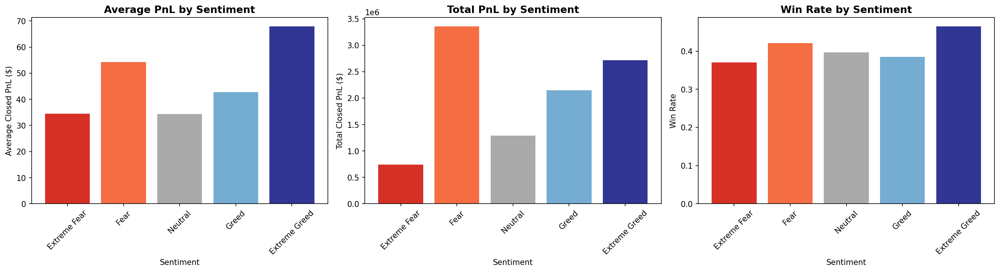
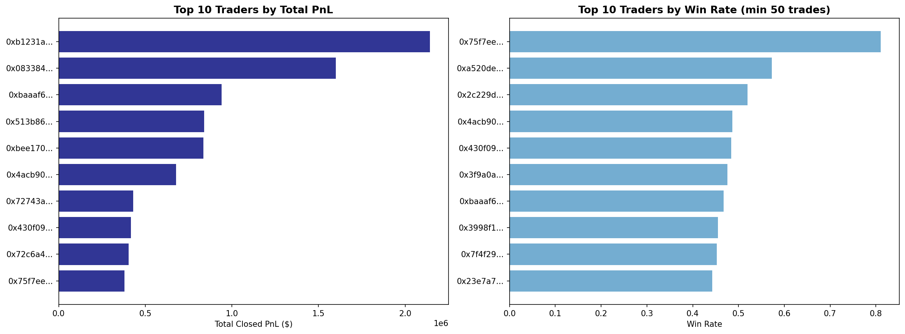

# 📊 Bitcoin Market Sentiment vs Trader Performance Analysis

An analysis of **211,224 real trades** from Hyperliquid matched against the **Bitcoin Fear & Greed Index** to uncover how market sentiment affects trader performance and profitability.

---

## 📁 Project Structure
```
bitcoin-sentiment-analysis/
│
├── analysis.ipynb          # Main Jupyter Notebook with all code and insights
├── sentiment_analysis.png  # Charts: Avg PnL, Total PnL, Win Rate by Sentiment
├── top_traders.png         # Charts: Top 10 traders by PnL and Win Rate
└── README.md               # Project overview (this file)
```

---

## 📦 Datasets Used

| Dataset | Description | Rows |
|---|---|---|
| Hyperliquid Historical Trades | Real trader data — account, coin, side, PnL, fees, timestamps | 211,224 |
| Bitcoin Fear & Greed Index | Daily market sentiment score and classification | 2,644 |

---

## 🛠️ Libraries Used
- `pandas` — data loading, cleaning, merging, grouping
- `matplotlib` — chart creation
- `seaborn` — chart styling
- `numpy` — numerical operations

---

## 🔍 Analysis Performed

1. **Data Cleaning & Merging** — Extracted dates from trader timestamps and merged both datasets on date
2. **Sentiment vs PnL** — Average and total profit/loss grouped by Fear/Greed classification
3. **Win Rate Analysis** — % of profitable trades per sentiment period
4. **Trade Behavior** — Buy/Sell ratio, trade size, and fees across sentiments
5. **Top Trader Analysis** — Identified highest earning and most consistent traders
6. **Best Trader Deep Dive** — Studied the #1 win rate trader's behavior across sentiments

---

## 💡 Key Insights

### 1: Extreme Greed = Best Quality Trades
- Highest average PnL per trade: **$67.89**
- Highest win rate: **46.5%**
- Traders make the most profit per individual trade when the market is euphoric

### 2: Fear = Most Activity, Most Total Profit
- Most trades happen during Fear periods: **61,837 trades**
- Highest total profit generated: **$3.35 million**
- Traders put the most money per trade during Fear: **$7,816 avg trade size**

### 3: Contrarian Behavior is Profitable
- During **Extreme Fear**: traders BUY more (51%) than sell — "buy the fear"
- During **Extreme Greed**: traders SELL more (55%) than buy — "take profits"
- This contrarian behavior aligns with the most profitable outcomes

### 4: Neutral Markets are Dangerous
- Lowest average PnL: **$34.31**
- Even the best trader in the dataset LOSES money during Neutral periods
- Risk/reward is poorest when market has no clear direction

### 5: The Best Trader — A Case Study
- Achieved **81% overall win rate** across 9,893 trades
- Best performance during Extreme Fear: **91% win rate**
- Perfectly balanced Buy/Sell ratio — no directional bias
- Focuses on altcoins (JELLY, ZEREBRO, PURR) rather than BTC/ETH

---

## 📈 Charts

### Sentiment vs Performance


### Top Traders


---

## 🚀 How to Run

1. Clone the repository
```bash
git clone https://github.com/YourUsername/bitcoin-sentiment-analysis.git
```

2. Install required libraries
```bash
pip install pandas matplotlib seaborn numpy
```

3. Open the notebook
```bash
jupyter notebook analysis.ipynb
```

4. Run all cells from top to bottom

---

## 🧠 Recommendations for Traders

1. **Be most active during Fear and Extreme Greed** — best opportunities exist at extremes
2. **Buy during Fear, Sell during Greed** — contrarian strategy is backed by the data
3. **Reduce trades during Neutral periods** — lowest returns, not worth the risk
4. **Focus on altcoins during extreme sentiment** — highest volatility = highest opportunity for skilled traders

---

## 👤 Author
Made by — shry28(https://github.com/YourUsername)
